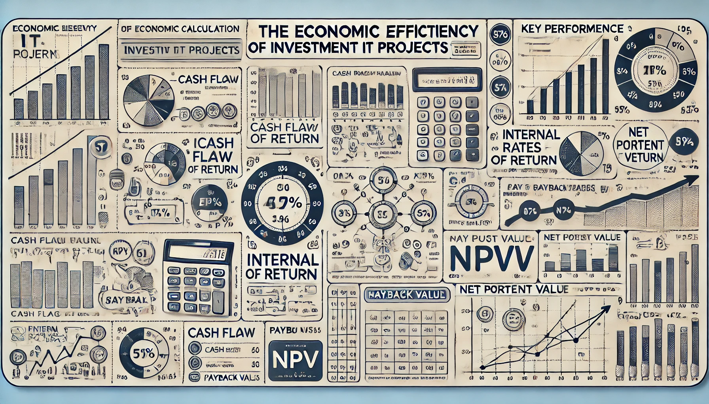

# Расчет экономической  эффективности инвестиционных IT-проектов и ЗНИ

## Описание проекта

Это приложение предназначено для расчета экономических эффектов IT-проектов и запросов на изменение (ЗНИ). Оно позволяет пользователям вводить данные проекта, выполнять расчеты, визуализировать результаты и проводить анализ чувствительности.

Шаблон для загрузки данных для анализа доступен по ссылке [Шаблон для загрузки](data/test_project_data.xlsx).

Прототип приложения для ознакомления развернут по адресу [Прототип приложения](https://economic-b257ba29b4eqyr2dfe6yso.streamlit.app/).

## Что рассчитывается?

Приложение выполняет следующие ключевые расчеты:

- **NPV (Чистая приведенная стоимость)**: Оценивает прибыльность инвестиций с учетом временной стоимости денег.
- **IRR (Внутренняя норма доходности)**: Показывает процентную ставку, при которой NPV проекта равен нулю.
- **Срок окупаемости**: Время, необходимое для возврата первоначальных инвестиций.
- **Индекс прибыльности**: Отношение приведенной стоимости будущих денежных потоков к первоначальным инвестициям.
- **Анализ чувствительности**: Оценка влияния изменений ключевых параметров на экономические показатели проекта.

## Экономические выгоды и польза для бизнеса

- **Обоснованное принятие решений**: Приложение предоставляет четкие экономические показатели, помогающие руководству принимать обоснованные решения о реализации IT-проектов или внесении изменений.
- **Оптимизация инвестиций**: Анализ чувствительности позволяет выявить наиболее критичные факторы, влияющие на успех проекта, что помогает оптимизировать инвестиции и снизить риски.
- **Экономия времени**: Автоматизация расчетов значительно сокращает время на оценку экономической эффективности проектов, позволяя быстрее реагировать на изменения рынка.
- **Стандартизация оценки**: Единый инструмент обеспечивает стандартизированный подход к оценке всех IT-проектов в организации, что повышает объективность сравнения различных инициатив.
- **Визуализация данных**: Графическое представление результатов облегчает понимание экономических показателей для всех заинтересованных сторон, включая нетехнических специалистов.

## Почему это важно?

В современном бизнесе IT-проекты часто являются ключевыми драйверами роста и инноваций. Однако они также могут быть источником значительных затрат и рисков. Точная оценка экономической эффективности IT-проектов критически важна для:

- Обеспечения рационального использования ресурсов компании
- Приоритизации проектов с наибольшей отдачей
- Минимизации рисков неудачных инвестиций
- Обоснования IT-бюджетов перед руководством и акционерами
- Постоянного улучшения процессов планирования и реализации IT-инициатив

Данное приложение предоставляет мощный инструментарий для решения этих задач, способствуя более эффективному управлению IT-портфелем и, как следствие, повышению конкурентоспособности бизнеса в целом.

## Структура проекта

## Описание файлов

- **app.py**: Главный файл приложения, который запускает Streamlit и управляет навигацией между разделами.
- **modules/analiz_if.py**: Модуль для проведения анализа чувствительности проекта.
- **modules/calculate.py**: Модуль для выполнения основных расчетов (NPV, IRR, др.).
- **modules/input_data.py**: Модуль для ввода и обработки данных проекта.
- **modules/out_data.py**: Модуль для вывода результатов расчетов.
- **modules/visual_out_data.py**: Модуль для визуализации результатов с помощью графиков.
- **utils/utils.py**: Вспомогательные функции для работы с данными и Excel-файлами.
- **data/test_project_data.xlsx**: Тестовый Excel-файл с примером данных проекта.
- **requirements.txt**: Список необходимых Python-пакетов для работы приложения.

## Установка и запуск

1. Клонируйте репозиторий:
    ```sh
    git clone https://github.com/your-username/ECONOMIC.git
    cd ECONOMIC
    ```

2. Создайте виртуальное окружение и активируйте его:
    ```sh
    python -m venv venv
    source venv/bin/activate  # Для Unix-систем
    venv\Scripts\activate  # Для Windows
    ```

3. Установите зависимости:
    ```sh
    pip install -r requirements.txt
    ```

4. Запустите приложение:
    ```sh
    streamlit run app.py
    ```

## Основные функции

- Ввод данных проекта (вручную или загрузка из Excel)
- Расчет экономических показателей (NPV, IRR, срок окупаемости)
- Визуализация результатов с помощью графиков
- Анализ чувствительности проекта
- Экспорт результатов в Excel

## Зависимости

Основные зависимости проекта:

- streamlit
- pandas
- numpy
- plotly
- openpyxl
- XlsxWriter
- scipy

Полный список зависимостей находится в файле `requirements.txt`.

## Теория

Для получения положительного IRR, нам нужно создать ситуацию, где проект начинается с отрицательного денежного потока (инвестиции), а затем генерирует положительные денежные потоки, превышающие начальные инвестиции. Давайте подберем подходящие значения:

Оставим срок проекта 5 лет и срок влияния 5 лет.
Ставку дисконтирования оставим 0.10 (10%).
Изменим данные по годам следующим образом:

Год 1:
- Выручка: 0
- Фиксированные операционные затраты: 100,000
- Капитальные затраты: 1,000,000

Год 2:
- Выручка: 500,000
- Фиксированные операционные затраты: 200,000
- Капитальные затраты: 0

Год 3:
- Выручка: 800,000
- Фиксированные операционные затраты: 300,000
- Капитальные затраты: 0

Год 4:
- Выручка: 1,200,000
- Фиксированные операционные затраты: 400,000
- Капитальные затраты: 0

Год 5:
- Выручка: 1,500,000
- Фиксированные операционные затраты: 500,000
- Капитальные затраты: 0

Обоснование:

- В первый год у нас большие инвестиции и отрицательный денежный поток.
- В последующие годы выручка растет быстрее, чем затраты, создавая положительные денежные потоки.

Такая структура денежных потоков типична для многих инвестиционных проектов: сначала вложения, потом рост доходов.

С такими данными вы должны получить положительное значение IRR, которое будет выше ставки дисконтирования 10%. NPV также должен быть положительным.

Эти значения демонстрируют реалистичный сценарий развития проекта: большие начальные инвестиции, постепенный рост выручки и умеренный рост операционных затрат. Такая модель позволит корректно рассчитать как NPV, так и IRR.

Для получения IRR, равного 0 (или очень близкого к нулю), нужно создать ситуацию, где приведенная стоимость всех будущих денежных потоков в точности равна начальным инвестициям. Это означает, что NPV проекта будет равен (или очень близок) к нулю.

Вот пример такой ситуации:

Оставим срок проекта 5 лет и срок влияния 5 лет.
Ставку дисконтирования оставим 0.10 (10%).
Изменим данные по годам следующим образом:

Год 1:
- Выручка: 0
- Фиксированные операционные затраты: 100,000
- Капитальные затраты: 1,000,000

Год 2:
- Выручка: 300,000
- Фиксированные операционные затраты: 150,000
- Капитальные затраты: 0

Год 3:
- Выручка: 400,000
- Фиксированные операционные затраты: 200,000
- Капитальные затраты: 0

Год 4:
- Выручка: 500,000
- Фиксированные операционные затраты: 250,000
- Капитальные затраты: 0

Год 5:
- Выручка: 600,000
- Фиксированные операционные затраты: 300,000
- Капитальные затраты: 0

Обоснование:

- В первый год у нас большие инвестиции и отрицательный денежный поток.
- В последующие годы выручка растет, но не настолько быстро, чтобы проект был высокодоходным.
- Операционные затраты также растут пропорционально выручке.

С такими данными вы должны получить значение IRR, очень близкое к нулю (возможно, чуть выше или чуть ниже, в зависимости от точности расчетов). NPV также должен быть близок к нулю.

Эта ситуация демонстрирует проект, который едва окупается: все будущие доходы в точности компенсируют начальные инвестиции, не принося ни прибыли, ни убытка при учете временной стоимости денег.

Важно отметить, что точное достижение IRR = 0 может быть сложным из-за округлений и особенностей численных методов расчета. Обычно достаточно добиться значения, очень близкого к нулю (например, ±0.1%).

## Что такое NPV и IRR

Давайте объясним IRR и NPV на примере яблочного бизнеса, чтобы сделать эти понятия более понятными и наглядными.

### NPV (Чистая приведенная стоимость)

Представьте, что у вас есть волшебная корзина. Эта корзина может превращать будущие яблоки в сегодняшние. Но есть нюанс: чем дальше в будущем яблоки, тем меньше их становится при превращении.

Вы вкладываете 1000 золотых монет в посадку яблонь (это ваши инвестиции).
Каждый год в течение 5 лет ваш сад приносит яблоки, которые вы продаете:
- Год 1: 300 монет
- Год 2: 400 монет
- Год 3: 500 монет
- Год 4: 600 монет
- Год 5: 700 монет

Вы складываете все эти будущие монеты в волшебную корзину, и она превращает их в сегодняшние монеты. После превращения у вас оказывается, например, 2200 монет.
NPV = 2200 монет (полученные) - 1000 монет (вложенные) = 1200 монет

Если NPV положительный (как в нашем случае), проект считается выгодным.

### IRR (Внутренняя норма доходности)

Теперь представьте, что вы хотите узнать, насколько волшебной была ваша корзина. IRR - это как раз та магическая сила, с которой корзина превращала будущие яблоки в сегодняшние, при которой количество полученных монет точно равно вложенным.

Вы перебираете разные уровни "магии" для корзины.
Находите такой уровень, при котором 1000 вложенных монет превращаются ровно в 1000 монет после сбора всех будущих урожаев.
Допустим, это происходит при силе магии 15%. Это и есть ваш IRR.

### Связь между NPV и IRR

- Если IRR больше, чем стоимость денег (допустим, 10% в год), то проект выгоден, и NPV будет положительным.
- Если IRR меньше стоимости денег, то проект невыгоден, и NPV будет отрицательным.
- Если IRR равен стоимости денег, то NPV будет равен нулю.

В нашем яблочном примере:

- Если стоимость денег 10%, а IRR 15%, то проект выгоден (NPV > 0).
- Если бы стоимость денег была 20%, а IRR оставался 15%, проект был бы невыгоден (NPV < 0).

Таким образом, NPV показывает абсолютную выгоду проекта в сегодняшних деньгах, а IRR показывает относительную доходность проекта, которую можно сравнить с альтернативными вложениями или стоимостью денег.

## Лицензия

Этот проект распространяется под лицензией [указать тип лицензии]. Подробности см. в файле LICENSE.
